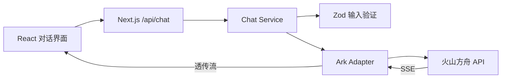

# 架构

```mermaid
flowchart LR
  UI[React 对话界面] --> API[Next.js /api/chat]
  API --> Service[Chat Service]
  Service --> Validator[Zod 输入验证]
  Service --> Adapter[Ark Adapter]
  Adapter --> Ark[火山方舟 API]
  Ark -->|SSE| Adapter -->|透传流| UI
```

依赖方向为 UI/API → Service → Core/Adapter。核心类型和错误不依赖外部库；火山方舟的 URL、认证和请求格式被隔离在适配器中。服务端添加固定系统提示词并验证外部输入，浏览器无法读取 API Key。
